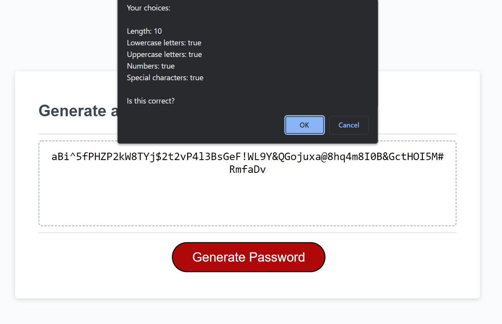

# Password Generator

  

     
    <h2 align="center"><a href="https://github.com/cdfoye/Password-Generator"><strong>Explore the docs »</strong></a></h2>
     
    <h2 align="center"><a href=" https://cdfoye.github.io/Password-Generator/">View Demo »</strong></a></h2>
     
     
  

<!-- PROJECT DESCRIPTION -->
<h1 align="center"> Project Description</h1>

This project modified starter code that contained an HTMl file, CSS file, and partial JavaScript file. A function was created in JavaScript that generates random passwords based on criteria selected by the user.

 
 

<!-- ABOUT THE PROJECT -->
<h1 align="center"> About The Project</h1>

The following is an image of the password generator's appearance and functionality:

 

